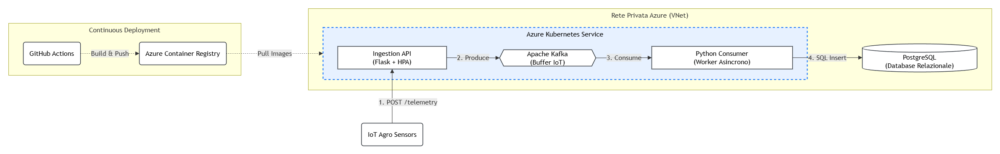

# AgroStream

AgroStream è una piattaforma IoT asincrona e Event-Driven progettata per l'acquisizione, la validazione e la storicizzazione di telemetrie provenienti da sensori agricoli. 

L'architettura gestisce alti volumi di dati concorrenti tramite un meccanismo di disaccoppiamento basato su Apache Kafka, garantendo che i picchi di traffico non saturino i servizi di backend. Fornisce inoltre una base affidabile per logiche aziendali in tempo reale, come l'irrigazione intelligente e la prevenzione delle patologie del raccolto.

## Architettura del Sistema

Il progetto è suddiviso nei seguenti componenti principali:
- **Ingestion API (Flask)**: Endpoint esposto su Kubernetes che riceve le letture JSON dai sensori e produce immediatamente messaggi sul broker Kafka, minimizzando la latenza per il client IoT.
- **Apache Kafka**: Strato di buffer per assorbire anomalie e ondate di traffico, smistando gli eventi sul topic di telemetria.
- **Python Consumer (Worker)**: Microservizio asincrono in costante ascolto, preposto al prelievo dei messaggi, all'elaborazione delle metriche (temperatura, umidità, livelli NPK) e all'inserimento a database.
- **PostgreSQL**: Database relazionale utilizzato per la memorizzazione strutturata e l'indicizzazione temporale dei record elaborati.

## Infrastruttura e Deploy

L'infrastruttura segue il paradigma Cloud-Native ed è ospitata interamente su Microsoft Azure:
- **IaC (Terraform)**: Il provisioning delle risorse di rete (VNet), del cluster e del server database è interamente automatizzato tramite approccio dichiarativo.
- **Orchestrazione (AKS)**: Azure Kubernetes Service governa il ciclo di vita dei microservizi, assicurandone l'alta affidabilità e la scalabilità orizzontale dinamica tramite Horizontal Pod Autoscaler (HPA).
- **Sicurezza**: Il database è segregato all'interno della Virtual Network; le credenziali non risiedono nel codice ma sono iniettate tramite Kubernetes Secrets.
- **CI/CD Pipeline**: I workflow di GitHub Actions automatizzano le fasi di linting, build, push su Azure Container Registry (ACR) e il rolling update automatico sul cluster di produzione.

## Esecuzione Locale

Per facilitare lo sviluppo e i test, l'intero stack è orchestrato tramite Docker Compose:

1. Eseguire `docker-compose up -d --build` per l'avvio simultaneo di Zookeeper, Kafka, PostgreSQL, Ingestion API e Consumer.
2. Uno script di bootstrap genererà lo schema relazionale del database all'avvio.
3. L'API esporrà l'endpoint sulla porta 5000 (`POST /api/v1/telemetry`) pronto per ricevere il traffico di collaudo.
